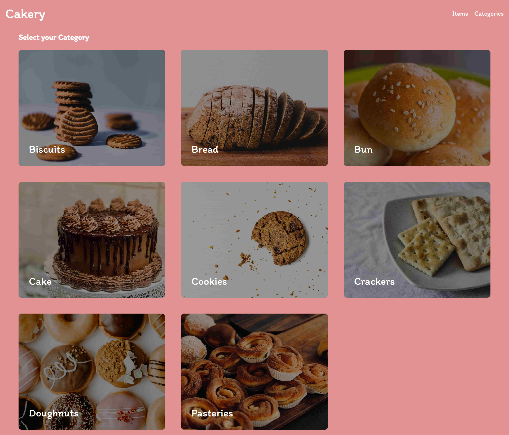
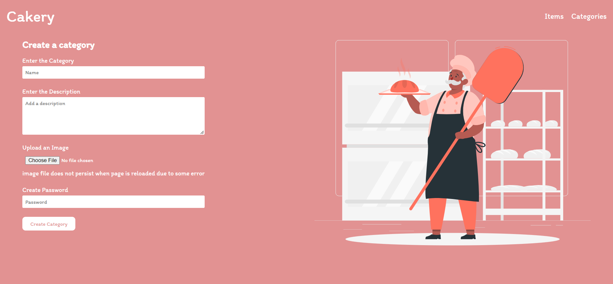

# Cakery

An Inventory app made with Express and MongoDB.

Features -

- Add, update, delete and view an item.
- Add, update, delete and view a category.

## Live

[Click here](https://cute-tan-leg-warmers.cyclic.app/inventory/)

## Demo Screenshots

## Tech Stack use

- Data is stored in MongoDB through Mongoose, an ODM library for MongoDB.
- Data is validated with the help of express-validator.
- Multer middleware is used to handle image files.
- Asynchronous code is handled by async library.
